# 3. Архитектура проекта «АлИИна»

## Общая архитектура

**Архитектурный подход:** Модульный монолит с выделенными сервисными слоями.

Система состоит из трёх основных уровней:
1. **Клиентский уровень (Frontend)** — встраиваемый чат-виджет на сайте
2. **Серверный уровень (Backend)** — API-сервер с бизнес-логикой, AI-движком и интеграциями
3. **Внешние сервисы** — LLM API, STT API, TTS API, Telegram Bot API

Модульная структура позволяет заменять отдельные компоненты (LLM-провайдера, TTS/STT-сервис) без переписывания остальной системы.

---

## Диаграмма общей архитектуры

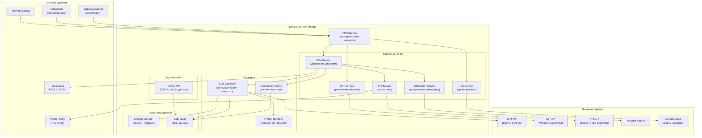

---

## Структура проекта

```
aliina/
├── client/                          # Frontend — Чат-виджет
│   ├── widget.js                    # Основной скрипт виджета (точка входа)
│   ├── widget.css                   # Стили виджета
│   ├── components/
│   │   ├── ChatWindow.js            # Окно чата (отображение сообщений)
│   │   ├── MessageInput.js          # Текстовое поле ввода + отправка
│   │   ├── VoiceRecorder.js         # Кнопка микрофона + запись голоса
│   │   ├── AudioPlayer.js           # Воспроизведение голосовых ответов (TTS)
│   │   ├── FileUploader.js          # Загрузка файлов/фото
│   │   ├── StatusIndicator.js       # «АлИИна печатает...» / «говорит...»
│   │   └── WidgetToggle.js          # Кнопка свернуть/развернуть
│   └── utils/
│       ├── api.js                   # HTTP-клиент для API
│       └── audio.js                 # Утилиты для аудио (MediaRecorder, playback)
│
├── server/                          # Backend — API-сервер
│   ├── app.js                       # Точка входа сервера
│   ├── config/
│   │   ├── config.js                # Конфигурация (порты, ключи, режимы)
│   │   └── prompts/
│   │       └── system_prompt.txt    # Системный промт АлИИны
│   │
│   ├── routes/
│   │   ├── chat.js                  # POST /api/chat — основной чат
│   │   ├── stt.js                   # POST /api/stt — распознавание речи
│   │   ├── tts.js                   # POST /api/tts — синтез речи
│   │   ├── upload.js                # POST /api/upload — загрузка файлов
│   │   └── admin.js                 # CRUD /api/admin/* — управление БД
│   │
│   ├── services/
│   │   ├── ChatService.js           # Управление диалогом, контекст сессии
│   │   ├── LLMService.js            # Интеграция с LLM (OpenAI API)
│   │   ├── STTService.js            # Интеграция со STT-сервисом
│   │   ├── TTSService.js            # Интеграция с TTS-сервисом
│   │   ├── CalculationService.js    # Расчёт стоимости мебели
│   │   ├── FileService.js           # Обработка и хранение файлов
│   │   ├── NotificationService.js   # Уведомления менеджеру (Telegram/Email)
│   │   └── SessionManager.js        # Управление сессиями и историей
│   │
│   ├── data/                        # Базы данных (JSON-файлы, редактируемые)
│   │   ├── db_company_info.json     # DB-COMPANY-INFO
│   │   ├── db_price_category.json   # DB-PRICE-CATEGORY
│   │   ├── db_model_numbers.json    # DB-MODEL-NUMBERS
│   │   └── db_exception.json        # DB-EXCEPTION
│   │
│   ├── middleware/
│   │   ├── auth.js                  # Аутентификация (админ-панель)
│   │   ├── cors.js                  # CORS для виджета
│   │   ├── rateLimit.js             # Ограничение частоты запросов
│   │   └── validation.js            # Валидация входных данных
│   │
│   └── utils/
│       ├── urlParser.js             # Парсинг ссылок (извлечение номера модели)
│       ├── unitConverter.js         # Конвертация единиц (см→м, мм→м)
│       └── logger.js               # Логирование
│
├── admin/                           # Админ-панель (веб-интерфейс)
│   ├── index.html                   # Главная страница админ-панели
│   ├── admin.js                     # Логика CRUD-операций
│   └── admin.css                    # Стили
│
├── tests/                           # Тесты
│   ├── unit/
│   │   ├── calculation.test.js      # Тесты расчёта стоимости
│   │   ├── urlParser.test.js        # Тесты парсинга ссылок
│   │   └── unitConverter.test.js    # Тесты конвертации единиц
│   ├── integration/
│   │   ├── chat.test.js             # Интеграционные тесты чат-API
│   │   └── notification.test.js     # Тесты уведомлений
│   └── e2e/
│       └── dialog.test.js           # E2E тесты полного диалога
│
├── docs/                            # Документация
│   ├── 1_idea.md
│   ├── 2_technical_specification.md
│   └── 3_architecture.md
│
├── .env.example                     # Пример переменных окружения
├── package.json
└── README.md
```

---

## Диаграмма компонентов и их взаимодействия

### Клиентский уровень (Frontend Widget)

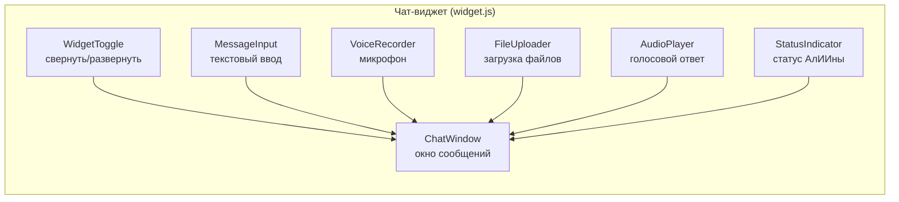

**Ответственности компонентов:**

| Компонент | Ответственность |
|-----------|----------------|
| `WidgetToggle` | Кнопка-иконка для открытия/закрытия виджета на сайте |
| `ChatWindow` | Отображение истории сообщений (клиент + АлИИна), автопрокрутка |
| `MessageInput` | Текстовое поле + кнопка отправки, обработка Enter |
| `VoiceRecorder` | Запись аудио с микрофона (MediaRecorder API), отправка на STT |
| `FileUploader` | Выбор и отправка файлов/фото (проект клиента) |
| `AudioPlayer` | Воспроизведение голосовых ответов АлИИны (TTS) |
| `StatusIndicator` | Индикаторы: «печатает...», «говорит...», «распознаёт голос...» |

### Серверный уровень (Backend)

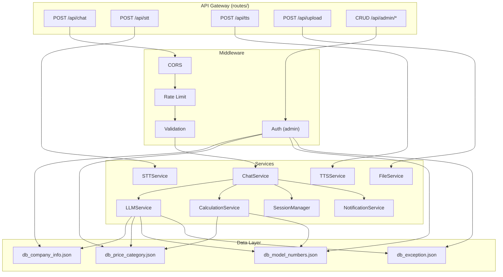

---

## Описание сервисов

### ChatService — управление диалогом
**Ответственность:** Центральный координатор диалога. Принимает сообщение клиента, передаёт в LLMService, получает ответ, при необходимости инициирует расчёт, TTS и уведомления.

**Входные данные:**
- Текстовое сообщение клиента (или распознанный текст из STT)
- ID сессии

**Выходные данные:**
- Текстовый ответ АлИИны
- Ссылка на аудио-ответ (если голосовой режим)
- Флаг завершения диалога

### LLMService — интеграция с LLM
**Ответственность:** Формирование запроса к LLM (системный промт + история сессии + сообщение клиента), обработка ответа, потоковая генерация (streaming).

**Ключевые элементы:**
- Системный промт загружается из `system_prompt.txt`
- Базы данных подставляются в контекст (DB-COMPANY-INFO, DB-PRICE-CATEGORY, DB-MODEL-NUMBERS, DB-EXCEPTION)
- Внутренний JSON клиента передаётся в контексте, но скрыт от ответа
- Поддержка streaming (SSE / WebSocket) для потокового вывода

### CalculationService — расчёт стоимости
**Ответственность:** Вычисление ориентировочной стоимости мебели по формулам.

**Алгоритмы:**
| Тип расчёта | Формула |
|-------------|---------|
| По категории | `Цена_категории × Длина(м)` |
| По номеру модели | `Цена_модели × Длина(м)` |
| Гардеробная (П) | `Цена × ((глубина × 2) + ширина)` |
| Гардеробная (Г) | `Цена × (глубина + ширина)` |
| Гардеробная (Прямая) | `Цена × ширина` |
| Угловой шкаф | `Цена × (ширина₁ + ширина₂)` |
| Угловой шкаф-купе | `Цена × (ширина₁ + ширина₂)` |

**Утилиты:**
- `unitConverter` — перевод см→м, мм→м, извлечение длины из формата `159×60×240`
- `urlParser` — извлечение номера модели из URL (`uglovoi-shkaf-s-zerkalom-23` → №23)

### STTService — распознавание речи
**Ответственность:** Приём аудио-файла от клиента, отправка на внешний STT API, возврат распознанного текста.

**Поток данных:**
```
Микрофон → MediaRecorder (WebM/Opus) → POST /api/stt → Whisper API → текст → ChatService
```

### TTSService — синтез речи
**Ответственность:** Приём текста ответа АлИИны, отправка на внешний TTS API, возврат аудио-файла.

**Поток данных:**
```
Текст ответа → POST /api/tts → TTS API → аудио (MP3/OGG) → AudioPlayer (клиент)
```

**Параметры голоса:**
- Язык: русский
- Голос: женский, естественный (образ «АлИИна»)
- Формат: MP3 или OGG Opus

### NotificationService — уведомления менеджеру
**Ответственность:** Отправка собранных данных клиента менеджеру при завершении диалога.

**Триггеры:**
- Клиент записался на замер (собраны город, улица, телефон)
- Клиент прислал проект (собраны время, проект)
- Клиент позвал менеджера (собраны телефон, время)

**Каналы:**
- Telegram Bot → чат менеджера
- Email (SMTP) — резервный канал

**Формат сообщения менеджеру:**
```
📋 Новая заявка от АлИИны

👤 Имя: {Client_name}
🪑 Мебель: {Mebel_name}
📏 Размер: {Dlina}
💰 Ориент. стоимость: {Orientir_price}
🏙 Город: {Gorod}
🏠 Улица: {Ylitsa}
⏰ Удобное время: {Vremya_client}
📎 Проект: {Client_Project}
```

### SessionManager — управление сессиями
**Ответственность:** Хранение и управление данными сессий (история сообщений, внутренний JSON клиента).

**Структура сессии:**
```
session_id → {
  created_at,
  messages: [...],
  client_data: { внутренний JSON },
  state: { asked_name, asked_model_question, confirmed_calculation, ... },
  voice_mode: true/false
}
```

**Хранение:**
- In-memory (Redis / Map) для активных сессий
- Запись в лог-файл / БД при завершении диалога (для аналитики)
- TTL сессии: 30 минут без активности

### FileService — обработка файлов
**Ответственность:** Приём файлов/фото от клиента, сохранение в S3-хранилище, возврат ссылки.

**Ограничения:**
- Форматы: JPG, PNG, PDF, DOC, DOCX
- Максимальный размер: 10 МБ
- Файл сохраняется с привязкой к session_id

---

## База данных

### Схема хранения данных

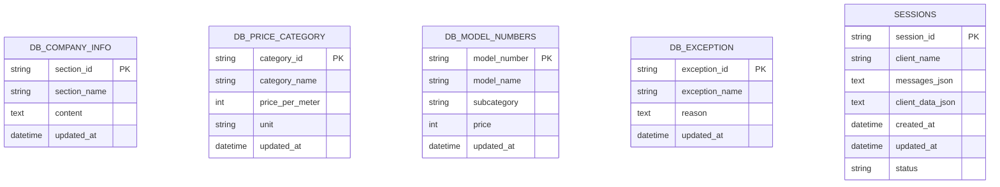

### Модели данных

| Модель | Поля | Описание |
|--------|------|----------|
| `DB_COMPANY_INFO` | section_id, section_name, content, updated_at | Разделы информации о компании (текстовые блоки) |
| `DB_PRICE_CATEGORY` | category_id, category_name, price_per_meter, unit, updated_at | Цены по категориям мебели (9 записей) |
| `DB_MODEL_NUMBERS` | model_number, model_name, subcategory, price, updated_at | Цены по номерам моделей (109+ записей) |
| `DB_EXCEPTION` | exception_id, exception_name, reason, updated_at | Исключения — мебель, которую не изготавливаем (4 записи) |
| `SESSIONS` | session_id, client_name, messages_json, client_data_json, created_at, status | Сессии диалогов для аналитики |

### Формат хранения

**Основной:** JSON-файлы в директории `server/data/` — для быстрого редактирования без инструментов БД.

**Пример `db_price_category.json`:**
```json
[
  { "category_id": "garderobnie", "category_name": "Гардеробные", "price_per_meter": 29000, "unit": "м" },
  { "category_id": "prihozhie_raspashnye", "category_name": "Прихожие, распашные шкафы", "price_per_meter": 55000, "unit": "м" },
  { "category_id": "shkafy_kupe", "category_name": "Шкафы-купе", "price_per_meter": 60000, "unit": "м" }
]
```

**Для продакшна:** Миграция на SQLite/PostgreSQL с сохранением JSON API для админ-панели.

---

## API

### Эндпоинты

| Метод | URL | Описание | Входные данные | Ответ |
|-------|-----|----------|---------------|-------|
| POST | `/api/chat` | Отправка текстового сообщения | `{ session_id, message, voice_mode }` | `{ reply, audio_url?, dialog_ended }` |
| POST | `/api/stt` | Распознавание голоса → текст | `audio file (multipart)` | `{ text, confidence }` |
| POST | `/api/tts` | Синтез речи из текста | `{ text }` | `audio file (binary)` |
| POST | `/api/upload` | Загрузка файла/фото проекта | `file (multipart), session_id` | `{ file_url, file_id }` |
| GET | `/api/admin/db/:name` | Получить содержимое базы | — | `{ data: [...] }` |
| PUT | `/api/admin/db/:name` | Обновить содержимое базы | `{ data: [...] }` | `{ success, updated_at }` |
| POST | `/api/admin/db/:name/item` | Добавить запись в базу | `{ item: {...} }` | `{ success, item_id }` |
| DELETE | `/api/admin/db/:name/item/:id` | Удалить запись из базы | — | `{ success }` |

### Формат потокового ответа (SSE)

Для `POST /api/chat` с поддержкой streaming:
```
event: token
data: {"token": "Ориент"}

event: token
data: {"token": "ировочная"}

event: token
data: {"token": " стоимость"}

event: done
data: {"full_reply": "Ориентировочная стоимость — 95 000 рублей...", "audio_url": "/api/tts/abc123"}
```

---

## Потоки данных

### Поток 1 — Текстовое сообщение

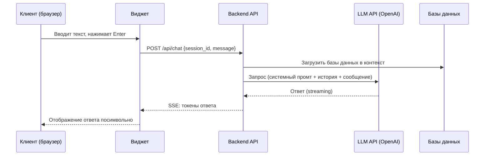

### Поток 2 — Голосовое сообщение

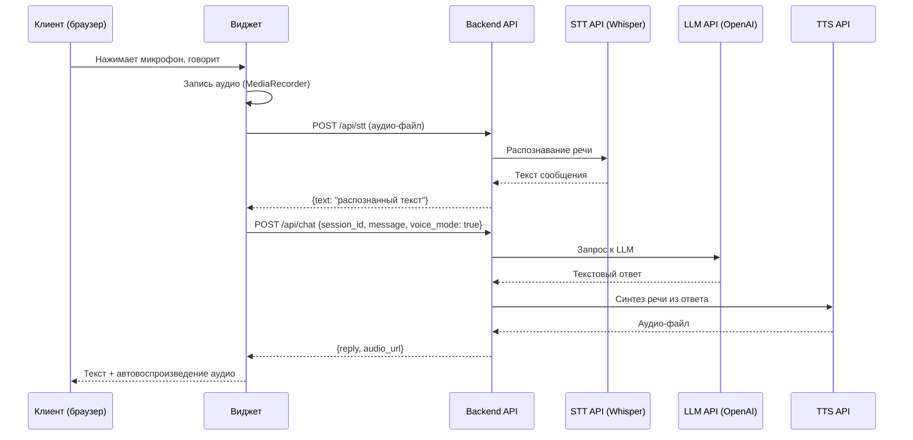

### Поток 3 — Загрузка проекта

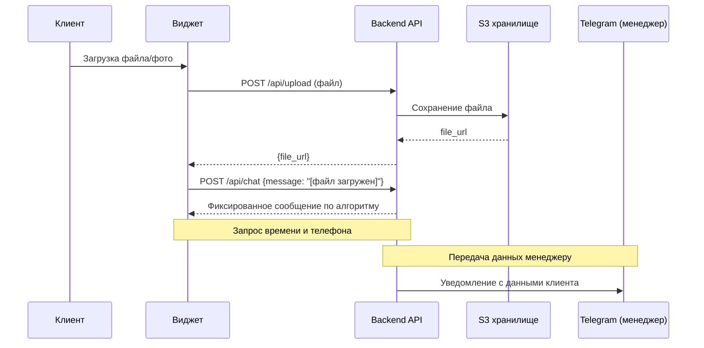

### Поток 4 — Уведомление менеджера

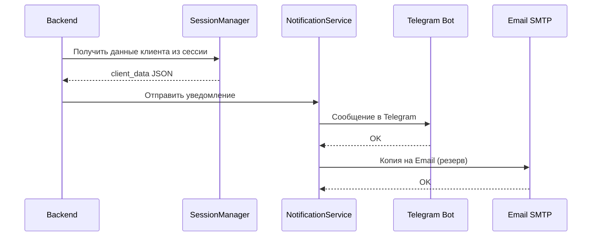

---

## Паттерны проектирования

| Паттерн | Где используется | Обоснование |
|---------|-----------------|-------------|
| **Service Layer** | Все сервисы (ChatService, LLMService и др.) | Отделение бизнес-логики от маршрутов API. Упрощает тестирование и замену компонентов |
| **Strategy** | LLMService, STTService, TTSService | Возможность замены провайдера (OpenAI → Yandex → ElevenLabs) без изменения бизнес-логики |
| **Middleware Chain** | CORS, Rate Limit, Validation, Auth | Последовательная обработка запросов с возможностью добавления новых middleware |
| **Observer** | NotificationService | Подписка на события завершения диалога для отправки уведомлений менеджеру |
| **Repository** | Data Layer (JSON-файлы → БД) | Абстракция доступа к данным. При миграции JSON → PostgreSQL меняется только репозиторий |
| **Session / State** | SessionManager | Хранение состояния диалога, истории сообщений и данных клиента в рамках сессии |
| **Factory** | Создание ответов, расчётов | Формирование ответа клиенту в зависимости от типа запроса (информация, расчёт, замер) |

---

## Схема навигации (пользовательские потоки)

### Поток клиента

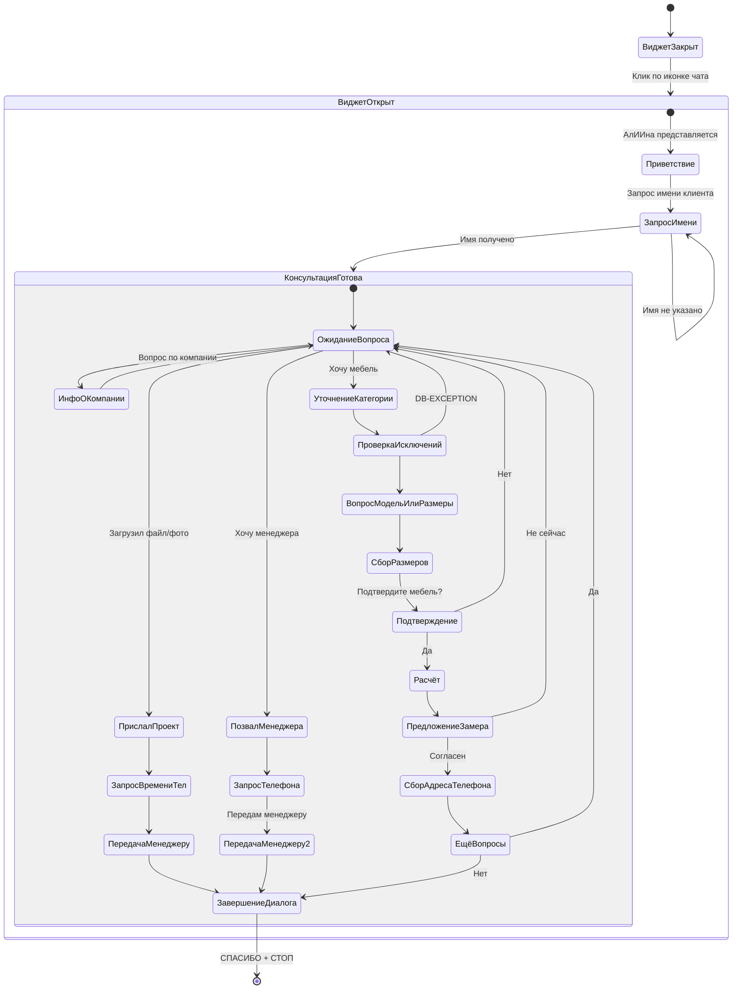

### Поток администратора

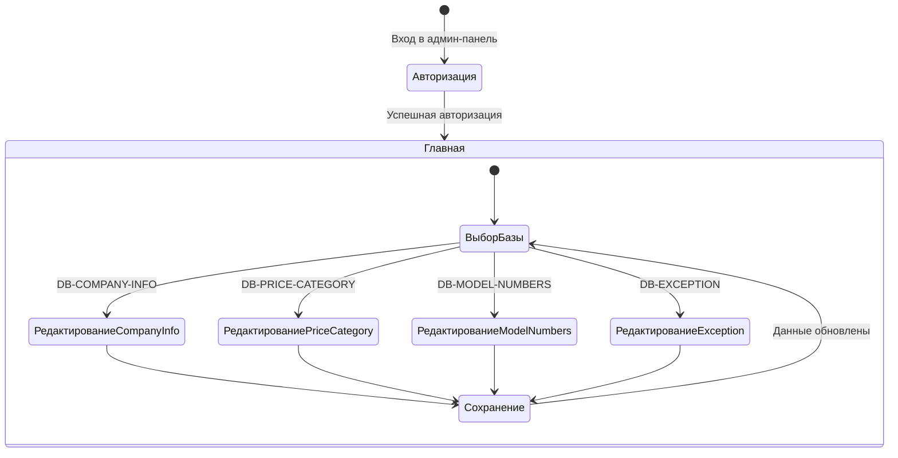

---

## Безопасность

| Угроза | Мера защиты |
|--------|------------|
| Prompt Injection (клиент пытается изменить поведение AI) | Жёсткий системный промт, фильтрация входных сообщений, отдельный system/user контекст |
| Утечка API-ключей | Ключи хранятся в `.env` на сервере, не передаются на клиент |
| Утечка внутреннего JSON клиента | Инструкция в промте + серверная фильтрация ответа |
| DDoS / спам запросов | Rate Limiting (по IP и сессии), CAPTCHA при подозрении |
| Несанкционированный доступ к админ-панели | Аутентификация (логин/пароль), ограничение по IP |
| Передача персональных данных (ФЗ-152) | HTTPS, шифрование хранения, политика конфиденциальности на сайте |
| XSS через сообщения в чате | Экранирование HTML в выводе, Content Security Policy |

---

## Развёртывание (Deployment)

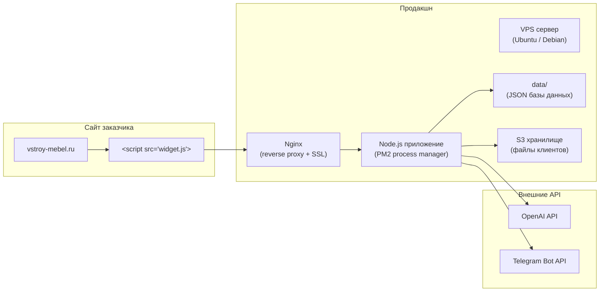

**Минимальные требования к серверу:**
- 2 vCPU, 4 ГБ RAM
- 20 ГБ SSD
- Ubuntu 22.04+
- Node.js 20+
- SSL-сертификат (Let's Encrypt)

**Встраивание на сайт:**
```html
<!-- Одна строка для подключения виджета -->
<script src="https://aliina.vstroy-mebel.ru/widget.js" defer></script>
```
